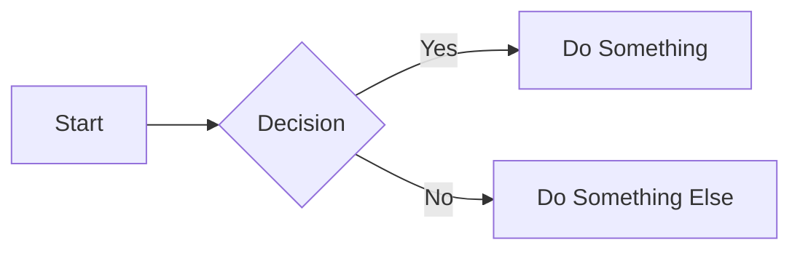

# Blog Setup Guide

This guide explains all the features and customizations for your Chirpy-themed Jekyll blog.

---

## 📝 1. Creating New Blog Posts

### Using the Template

A blog post template is available at `_drafts/YYYY-MM-DD-post-template.md`. To create a new post:

1. **Copy the template** from `_drafts/` to `_posts/`
2. **Rename the file** following Jekyll's naming convention:
   ```
   YYYY-MM-DD-your-post-title.md
   ```
   Example: `2025-10-05-my-new-post.md`

3. **Update the front matter** (the section between `---` markers):
   ```yaml
   ---
   layout: post
   title: "Your Awesome Title"
   date: 2025-10-05 12:00:00 +0000
   categories: [MainCategory, SubCategory]
   tags: [tag1, tag2, tag3]
   ---
   ```

4. **Write your content** using Markdown

5. **Preview your post** before publishing:
   ```bash
   bundle exec jekyll serve
   ```
   Visit `http://localhost:4000`

---

## 🏷️ 2. Understanding Categories

### Category Hierarchy

Categories in Chirpy use a **two-level hierarchy**:

```yaml
categories: [Level1, Level2]
```

**How it works:**
- **Level 1 (Main Category)**: The broad topic area
- **Level 2 (Subcategory)**: A more specific subtopic within the main category

### Examples:

| Category Structure | Meaning |
|-------------------|---------|
| `[Python, Data Science]` | Main topic: Python<br>Subtopic: Data Science |
| `[Python, Web Development]` | Main topic: Python<br>Subtopic: Web Development |
| `[Web Development, Frontend]` | Main topic: Web Development<br>Subtopic: Frontend |
| `[DevOps, Docker]` | Main topic: DevOps<br>Subtopic: Docker |
| `[Tutorial, Beginner]` | Main topic: Tutorial<br>Subtopic: Beginner level |

### Best Practices:

- **Use descriptive, broad terms for Level 1**
  - ✅ Good: `Python`, `Web Development`, `DevOps`
  - ❌ Avoid: `My Python Scripts`, `Random Stuff`

- **Use specific terms for Level 2**
  - ✅ Good: `Data Science`, `Machine Learning`, `Frontend`
  - ❌ Avoid: Being too general (e.g., `General`, `Misc`)

- **Keep categories consistent** across posts to help readers find related content

### Navigation:

- Readers can browse by category at: `yoursite.com/categories/`
- Each category gets its own page showing all posts in that category
- Categories appear in the sidebar navigation

---

## 📌 3. Post Ordering (Latest First)

**Good news!** Posts are automatically sorted **latest first** by default in Jekyll.

The most recent post (by date) appears at the top of:
- Your homepage
- Archive page
- Category pages
- Tag pages

### Pinning Posts

To keep a specific post at the very top regardless of date:

```yaml
---
layout: post
title: "Important Announcement"
date: 2025-10-05 12:00:00 +0000
categories: [Blogging, Announcement]
tags: [news, important]
pin: true  # ← This pins the post to the top
---
```

---

## 🖼️ 4. Avatar & Images

### Avatar (Sidebar Profile Picture)

Your avatar is set in `_config.yml`:
```yaml
avatar: /assets/images/avatar.png
```

**Location**: `assets/images/avatar.png`

**To change it**: Replace the file `assets/images/avatar.png` with your desired image.

### Favicon (Browser Tab Icon)

Your favicon is configured in `_config.yml`:
```yaml
favicon: /assets/images/favicon.png
```

**Location**: `assets/images/favicon.png`

**To change it**: Replace the file `assets/images/favicon.png` with your desired icon.

**Recommended size**: 512x512 pixels (PNG format)

---

## 🔗 5. Social Links in Sidebar

Your social media icons are configured in **two places**:

### A. Basic Info in `_config.yml`:

```yaml
github:
  username: trinathpanda  # Used for GitHub link

social:
  name: Trinath Panda
  email: pandatrinath1999@gmail.com  # Used for email link
```

### B. Display Settings in `_data/contact.yml`:

This controls **which icons appear** in the sidebar:

```yaml
- type: github
  icon: 'fab fa-github'

- type: linkedin
  icon: 'fab fa-linkedin'
  url: 'https://www.linkedin.com/in/trinath-panda'

- type: email
  icon: 'fas fa-envelope'
  noblank: true

- type: rss
  icon: 'fas fa-rss'
  noblank: true
```

### How to Add More Social Links:

**Uncomment and add entries in `_data/contact.yml`:**

```yaml
- type: twitter
  icon: 'fab fa-twitter'

- type: stackoverflow
  icon: 'fab fa-stack-overflow'
  url: 'https://stackoverflow.com/users/your-id'

- type: mastodon
  icon: 'fab fa-mastodon'
  url: 'https://mastodon.social/@yourusername'
```

**Important:** 
- For GitHub and Twitter, just set the username in `_config.yml`
- For other platforms, add the full URL in `_data/contact.yml`
- Icons use FontAwesome classes (find more at [FontAwesome](https://fontawesome.com/icons))

---

## 🎨 6. Customizations Applied

### Sidebar Width

The sidebar has been **reduced from 260px to 200px** for a more compact layout.

**File**: `assets/css/jekyll-theme-chirpy.scss`

To adjust further, edit this line:
```css
:root {
  --sidebar-width: 200px; /* Change this value */
}
```

### Footer

The footer text **"Using the Chirpy theme for Jekyll"** has been **removed**.

**File**: `_includes/footer.html`

Now the footer only shows:
```
© 2025 Trinath Panda. Some rights reserved.
```

---

## 🚀 7. Building and Deploying

### Local Development

```bash
# Install dependencies (first time only)
bundle install

# Run local server
bundle exec jekyll serve

# Run with drafts visible
bundle exec jekyll serve --drafts
```

Visit: `http://localhost:4000`

### Production Build

```bash
bundle exec jekyll build
```

### Deploy to GitHub Pages

**Important:** See **`GITHUB_PAGES_SETUP.md`** for first-time deployment setup!

You need to change your repository settings to use **GitHub Actions** instead of the default build.

After initial setup, deploying is simple:

```bash
git add .
git commit -m "Your commit message"
git push origin main
```

GitHub Actions will automatically build and deploy your site (takes 2-3 minutes).

---

## 📚 8. Additional Features Available

### Code Syntax Highlighting

```python
def hello_world():
    print("Hello, World!")
```

### Math Equations

Inline: \( E = mc^2 \)

Block:
\[
  \int_{-\infty}^{\infty} e^{-x^2} dx = \sqrt{\pi}
\]

### Mermaid Diagrams



### Featured Images

Add a featured image to any post:
```yaml
---
layout: post
title: "Post with Image"
date: 2025-10-05 12:00:00 +0000
categories: [Category1, Category2]
tags: [tag1, tag2]
image: /path/to/image.jpg  # ← Featured image
---
```

### Comments

Enable comments by configuring a provider in `_config.yml`:
- Disqus
- Utterances
- Giscus

### Analytics

Add Google Analytics, GoatCounter, or other analytics in `_config.yml`.

---

## 🆘 9. Troubleshooting

### Site not updating?

```bash
# Clear cache and rebuild
bundle exec jekyll clean
bundle exec jekyll build
```

### CSS not applying?

Hard refresh your browser: `Ctrl + F5` (Windows) or `Cmd + Shift + R` (Mac)

### Post not showing?

- Check the date in the filename matches the front matter
- Ensure the date is not in the future
- Verify the file is in `_posts/` (not `_drafts/`)

---

## 📖 10. Resources

- **Chirpy Theme Documentation**: https://chirpy.cotes.page/
- **Jekyll Documentation**: https://jekyllrb.com/docs/
- **Markdown Guide**: https://www.markdownguide.org/
- **Your Live Site**: https://trinathpanda.github.io

---

## ✅ Summary of Customizations

- ✅ Blog post template created in `_drafts/`
- ✅ Posts automatically sorted latest first
- ✅ Avatar set to `/assets/images/avatar.png`
- ✅ Favicon set to `/assets/images/favicon.png`
- ✅ Social media icons configured:
  - GitHub icon in sidebar
  - LinkedIn icon in sidebar
  - Email icon in sidebar
  - RSS feed icon in sidebar
- ✅ Sidebar width reduced to 200px
- ✅ "Using Chirpy theme" text removed from footer

**You're all set! Happy blogging! 🎉**

